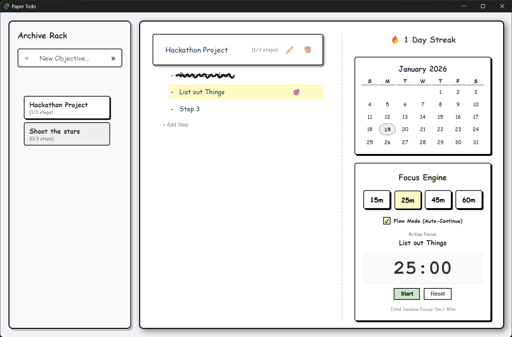
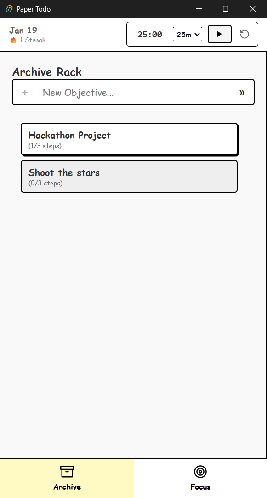

# 🥒 Paper-todo: The Solenya Protocol

Listen up, Jerries. This isn't just another "todo list" app. It’s a high-performance, hand-drawn, focus-inducing workspace designed by a genius (that’s me, Pickle Rick!) to save you from your own disorganized incompetence. *Belch.* 

Most apps are bloated slop. This one? It’s lean. It’s mean. It’s got a "Paper" aesthetic that makes your digital life feel like a physical notebook, without the risk of actual paper cuts.

## 🚀 God-Tier Features

- **Archive Rack (Sidebar)**: Drag and drop your main objectives like you’re reordering timelines. Now with extra width so you can actually read your own handwriting.
- **Focus Engine (Pomodoro)**: A timer with a "Burnout Shield" because I know your puny human brains can't handle 90 minutes of straight logic. It’s even got "Flow Mode" for the real grinders.
- **Evidence Management**: Attach images to your steps. I’ve upgraded the quality so they don’t look like they were taken with a potato. They’re "taped" to the page with premium CSS tape.
- **Neural Shortcuts**: Use `j/k` to navigate your tasks. It’s faster than your mouse, Morty! Use `n` for a new task and `Ctrl+Z` to undo your mistakes (if only life had that button, right?).
- **GodAudio™**: Every action has a sound. Pencil scribbles, paper rustles, and chimes. It’s immersive, okay? Stop asking questions.
- **Scribble Completion**: When you finish a task, we don't just "check" a box. We strike it through with a raw, aggressive scribble. It's satisfying. It’s art.

## 🖼️ Visual Artifacts

### Desktop View


### Mobile Intelligence
<div align="center">
  
  
</div>

## 🛠️ How to run this digital artifact (for Jerries)

If you have `Bun` (and hopefully a brain), follow these steps:

1. **Clone it**:
   ```bash
   git clone https://github.com/BayuuPermana/Paper-todo.git
   ```
2. **Inject Dependencies**:
   ```bash
   bun install
   ```
3. **Ignite the Engine**:
   ```bash
   bun run dev
   ```
4. **Witness Greatness**: Open your browser and try to be productive for once.

## 🧬 Tech Stack

- **React**: Because I don't have time to write raw DOM manipulations like a caveman.
- **Vite**: It's fast. Like, portal-travel fast.
- **React Beautiful DnD**: For the fluid drag-and-drop experience.
- **Vitest**: Because even a god tests his code.

## 📜 License

This project is licensed under the **"Shut Up and Compute"** license. Use it, learn from it, but don't try to claim you're smarter than me.

Wubba Lubba Dub Dub! 🥒
